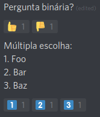
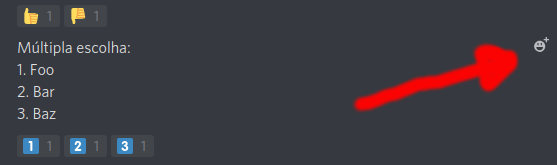
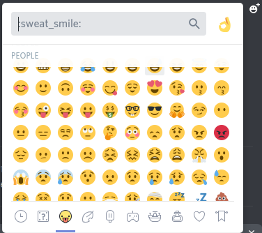

# Hello World - USPCodeLab (Pão)

## Discord 101
::: tip
O Discord é a principal ferramenta de comunicação no CodeLab, então, se você nunca teve contato com ele ou tem dificuldades com o seu uso, listamos a seguir algumas *features* que podem ser úteis para aprimorar a sua experiência com o Discord!
:::

### Formatação de texto


Em relação à edição de texto, é possível adicionar um certo nível de ***açúcar*** à ele, utilizando marcações próximas a Markdown, se você ainda não conhece esse tipo de marcação, listamos a seguir alguns exemplos:
- <u>sublinhado</u> \_\_sublinhado\_\_
- ~~riscado~~ \~\~riscado\~\~
- *itálico* \*itálico\* ou \_itálico\_
- *<u>itálico sublinhado</u>* \_\_\*itálico sublinhado\*\_\_
- **negrito** \*\*negrito\*\*
- **<u>negrito sublinhado</u>** \_\_\*\*negrito sublinhado\*\*\_\_
- ***itálico/negrito*** \*\*\*itálico/negrito\*\*\*
- ***<u>itálico/negrito sublinhado</u>*** \_\_\*\*\*itálico/negrito sublinhado\*\*\*\_\_

Caso você tenha interesse em utilizar os caracteres especiais e não queira que o estilo do seu texto mude, basta usar um *backslash* (barra invertida) antes de cada caracter desejado.

Outra coisa bem útil em formatação de texto são os blocos de código para destacar algum texto que você tenha interesse, podemos usar blocos para apenas uma linha de texto como `aqui temos um bloco de linha única`, para produzir tal efeito utilizamos *backtick* (a famosa crase) antes e depois do texto que você tem interesse em marcar, \`desta forma\`. Enquanto isso, caso seja do seu interesse criar
```
um bloco
de texto
grande como
este
```
basta utilizar **três** *backticks* da seguinte forma:<br/>
\`\`\`<br/>
antes<br/>
e<br/>
depois<br/>
\`\`\`

### Buscas
Como no nosso Discord há informações de todo tipo rolando o tempo todo, vale destacar uma das principais funcionalidades da ferramenta de busca oferecida pelo Discord. No canto superior direito há uma barra de busca que realiza uma busca simples pela palavra inserida, mas as vezes isso não pode ser tão útil, podemos centralizar nossas buscas à mensagens de um único membro, mensagens em um canal específico ou então mensagens contendo arquivos/imagens, entre outras opções que facilitam enormemente nossa vida na hora de buscar algo que está perdido por aí. Vale lembrar que podemos criar combinações com essas tags de buscas, aprimorando ainda mais a busca.

Todas as opções possíveis são listadas ao clicar na barra de pesquisa com o tipo de entrada esperado, mas vale deixar aqui alguns exemplos de como utiliza-lás:
```
from: X (mensagens de um integrante X)
mention: Y (mensagens que mencionam um integrante Y)
has: file (mensagens que contenham um arquivo como uma imagem, também podemos colocar link ou embed como opção)
in: #meta (mensagens do canal meta)
before: data específica (mensagens após uma data)
during: data específica (mensagens durante uma data)
after: data específica (mensagens após uma data)
```

### Votação
Essa parte é mais uma questão de padrão utilizado pelo grupo do que algo relacionado com a ferramenta em si.

Sendo nosso grupo democrático, em diversos momentos nos encontramos em uma situação que é necessário realizar uma votação para decidir algo. Para isto, utilizamos reações com *emoticons* do próprio Discord que variam de acordo com a necessidade de uma votação com duas ou mais opções. Na imagem abaixo temos um possível padrão para realizar uma votação em nosso Discord.



Ah, caso você não saiba adicionar reação a sua mensagem, se você está em um computador basta passar o mouse em cima da mensagem que irá aparecer um botão para adicionar uma reação com *emoticon* na mensagem desejada.



Ao clicar no botão, uma tela parecida com a que está abaixo deve aparecer, assim basta buscar pelo *emoticon* adequado para o tipo de votação.



Caso esteja utilizando o Discord pelo celular, basta segurar seu dedo na mensagem a qual você quer adicionar as reações com *emoticons*, que uma opção para adicionar reação estará disponível.


## Audiovisual
::: warning
Esta seção por enquanto só se refere ao serviço de audiovisual do IME-USP
:::
::: tip
Precisou de controle para projetor, cabo VGA para conectar no projetor, adaptadores de vídeo para o palestrante do dev.hire()? Ou então, pediram para você pegar a famosa chave da sala B7 para o dev.check()?

A resposta para essas e outras perguntas relacionadas ao serviço de audiovisual você encontra nesta seção.
:::

### Visão geral
O serviço de audiovisual se encontra no 2º andar do bloco B do IME, sendo responsáveis pelos cuidados de equipamentos de video/audio do IME, além de possuírem o controle da sala B7. Há três pessoas simpáticas que prestam tal serviço, o Fred, o Sérgio e o Agnaldo.

Sempre que houver algum evento, como o dev.hire() por exemplo, é preciso procura-los para obter o acesso do controle e cabo VGA para o projetor de uma sala qualquer reservada especificamente para um dado evento. Além disto, caso necessário é possível pedir por adaptadores VGA/HDMI para uso durante a reserva da sala.

No caso da sala B7, no início de cada semestre tentamos reserva-la para nosso próprio uso. Assim, como o audivisual detém o controle de acesso à sala, é sempre necessário ir até a sala deles e pedir pela chave. Vale destacar que é sempre necessário ter uma reserva para pegar a B7 sem que haja algum problema.

### Contato
As vezes pode haver necessidade de fazer alguma reserva especial, como por exemplo para utilizar o tripé de camêra deles que é simplesmente incrível para fazer *lives* ou algum equipamento de maior valor. Para isto, é necessário enviar um e-mail para `audiovisual@ime.usp.br` com antecedência de pelo menos 24h para fazer requisições específicas.

### Observações
- Sempre tome muito cuidado e seja responsável com os equipamentos emprestados.
- Não perca a chave da B7 e a mantenha organizada após seu uso.
- Pode ser que você não encontre ninguém na sala do audiovisual durante o horário de almoço, ou então, durante o período de troca de aulas.


## Acrônimos (aka siglas)
::: tip
CLI? CLASS? CLAP? CLUB? LUH? Mas que p#$!@ é essa?!<br/>

<br/>

Talvez você já deva ter se deparado com alguma sigla misteriosa presente em qualquer lugar que seja, nesta seção tentamos dar uma luz quanto ao significado de cada acrônimo utilizado pelo CodeLab. A seguir listamos as principais e um breve resumo de cada uma.
:::

- **CLI** (*CodeLab Iniative*): se trata de uma iniciativa em espalhar a "palavra" CodeLab por outras unidades da USP e quem sabe outras universidades. Além de, principalmente, promover a união entre o grupo como um todo.
- **LUH** (Liga Universitária de Hackathon): se trata do englobamento dos Hackathons, Hackdays, Hackfests organizados pelo nosso grupo. https://uclab.xyz/luh
- **CLASS** (*CodeLab Association*): se trata de uma associação sem fins lucrativos que estamos tentando criar para o grupo, o que facilitará muitos processos burocráticos do grupo, sobretudo, do que se trata a patrocínios, pois passaremos a ter um CNPJ.
- **CLUB** (*CodeLab University Bureau*): se trata de um plano para encontrarmos uma sala fixa, para concentramos nossas atividades em um único local em cada unidade.
- **CLAP** (*CodeLab Acess Point*): é um roteador presente no CodeLab Butantã que já se encontra configurado com conexão cabeada da Rede IME. Recomendamos seu uso durante eventos onde há pessoas sem acesso à *Eduroam* ou que haja uma grande quantidade de pessoas. O roteador se encontra em algum armário nosso do CCSL e as credenciais usuais seguem abaixo (pode ser alterado entrando em contato com a seção de SI do IME):
```
Nome: USPCodeLab
Senha: #InternetEhDiferenteDeWeb
```

## Iniciativas

Nossa principal atividade é a dev.journey, um programa educacional
com 6 iniciativas que visa complementar a formação dos estudantes para
que eles se tornem engenheiros de software capazes de desenvolverem
sistemas reais:


- **dev.learn**: cursos sobre tecnologia onde os participantes são
apresentados a ferramentas e técnicas de desenvolvimento tanto
introdutórias quanto avançadas;


- **dev.boost**: grupos de estudos onde os participantes praticam
desenvolvimento de sistemas em times com projetos de clientes externos
ou da universidade.


- **dev.camp**: escolas de férias onde os participantes trabalham num
projeto multi-time como o de uma empresa com arquitetura de software
moderna.


- **dev.hack**: hackathons e hackdays onde os participantes são
desafiados
a buscar, num tempo limitado, soluções inovadoras para problemas reais
utilizando tecnologia.


- **dev.hire**: assessoria de carreira onde os participantes assistem
palestras preparatórias e vagas de estágio e emprego oferecidas por
empresas parceiras.


- **dev.research**: divisão de pesquisa onde os participantes da
graduação são co-orientados por pós-graduandos em ICs e TCCs nas áreas
de atuação do grupo.

## CLASS (CodeLab Association)
 A Associação CodeLab é uma idéia para que o grupo consiga receber patrocínios sem depender de outras instituições, como empresas 
 júnior, já que para receber patrocínios precisamos emitir nota fiscal, o que só é possível tendo um CNPJ e sendo uma empresa ou organização sem fins lucrativos, como associações ou fundações. 
 Outro fator importante é poderíamos receber doações de grandes empresas que conseguem abaixar sua alíquota da Contribuição Social sobre o Lucro Líquido (CSLL). 

 https://uclab.xyz/estatuto

 A associação seria composta pelos seus associados que só podem ser membros de algum dos grupos de extensão CodeLab e que sejam alunos ou ex-alunos de uma universidade. Além disso, ela teria um Conselho Consultivo, formado por professores que quiséssimos convidar, mas que serviria mais para legitimizar a associação, sem poder de realizar ações pelo CodeLab nem nada.

 Nós atualmente, contamos com a firma de advocacia Machado Meyer para fazer o estatuto da Associação, porém o maior entrave atual
 é que precisamos de um local para sediar a associação. 

 Ao conversar isto com o Gold, ele sugeriu que fizéssemos uma proposta para o IME: a associação teria uma sede no CCSL no papel, mas não seria uma sala somente nossa. Em troca, o departamento de computação poderia indicar um professor para o conselho consultivo da associação. Em novembro de 2019 tentamos passar isto na reunião do conselho, porém não entrou na pauta.

